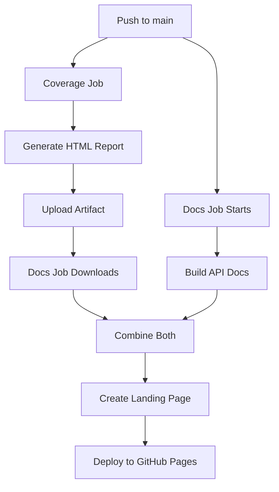

# GitHub Pages Setup

This document explains how the improved CI workflow deploys documentation and coverage reports to GitHub Pages.

## What Gets Deployed

The improved CI workflow automatically publishes to GitHub Pages on every push to `main`:

- **API Documentation** - Generated by `cargo doc`
- **Code Coverage Reports** - Generated by `cargo tarpaulin`
- **Beautiful Landing Page** - Modern card-based UI with links to everything

## URL Structure

Once GitHub Pages is enabled, your content will be available at:

```
https://<username>.github.io/io_uring_sync4/
├── index.html                    # Landing page (with cards)
├── io_uring_sync4/              # API documentation
│   └── index.html
└── coverage/                     # Coverage reports
    ├── index.html               # Auto-redirects to report.html
    └── report.html              # Full coverage report
```

## Enabling GitHub Pages

1. Go to your repository on GitHub
2. Click **Settings** → **Pages** (in the left sidebar)
3. Under "Build and deployment":
   - **Source**: Deploy from a branch
   - **Branch**: `gh-pages` / `(root)`
4. Click **Save**

That's it! The workflow will create and update the `gh-pages` branch automatically.

## How It Works

### Step 1: Coverage Job
1. Runs `cargo tarpaulin` to generate HTML coverage report
2. Renames `index.html` → `report.html`
3. Creates a new `index.html` that auto-redirects to the report
4. Uploads as an artifact for the docs job

### Step 2: Docs Job
1. Runs `cargo doc` to generate API documentation
2. Downloads the coverage artifact from the previous job
3. Creates a beautiful landing page at `index.html` with:
   - Gradient background
   - Card-based navigation
   - Links to docs, coverage, and GitHub
4. Moves coverage into `coverage/` subdirectory
5. Deploys everything to GitHub Pages using `gh-pages` branch

## Landing Page Features

The generated landing page includes:
- ✨ Modern, gradient design
- 📱 Responsive card layout
- 🔗 Quick links to:
  - API Documentation
  - Code Coverage
  - Source Code (GitHub)
- ⏰ Timestamp and commit info in footer

## Customization

### Update the Landing Page
Edit the HTML in `.github/workflows/ci-improved.yml` in the "Create documentation index with links" step.

### Add More Sections
You can add more cards to the landing page:

```html
<a href="benchmarks/index.html" class="card">
  <div class="card-icon">⚡</div>
  <div class="card-title">Benchmarks</div>
  <div class="card-desc">Performance metrics</div>
</a>
```

### Change Colors
Modify the gradient in the landing page CSS:

```css
background: linear-gradient(135deg, #667eea 0%, #764ba2 100%);
```

## Benefits

1. **Self-Hosted**: No dependency on external services like Codecov
2. **Always Available**: Coverage reports accessible 24/7
3. **Beautiful UI**: Professional landing page for your project
4. **Version History**: GitHub Pages keeps history via git
5. **Free**: No cost for public repositories
6. **Fast**: Direct hosting from GitHub's CDN

## Workflow Diagram



## Troubleshooting

### Pages Not Showing Up
- Ensure GitHub Pages is enabled in repository settings
- Check that the `gh-pages` branch exists
- Verify Actions have permission to write to the repository

### Permission Denied
Add this to repository Settings → Actions → General → Workflow permissions:
- ✅ Read and write permissions

### 404 Errors
- Wait a few minutes after first deployment
- Clear browser cache
- Check the published URL matches your repository name

## Related Files

- Workflow: `.github/workflows/ci-improved.yml`
- Coverage job: Lines 131-192
- Docs job: Lines 263-407

---

**Generated**: October 9, 2025

